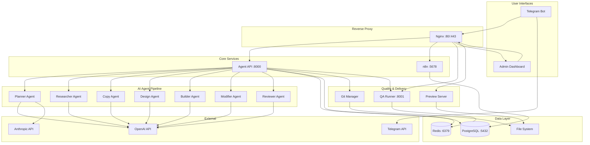
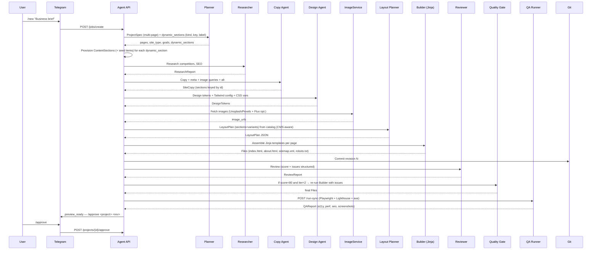
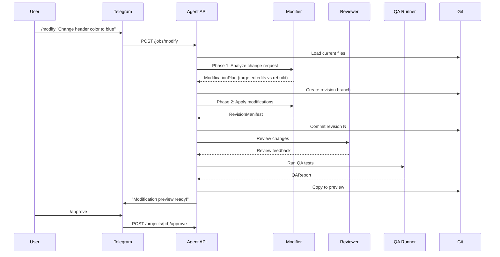

# AI Site System — Architecture

## Overview

A self-hosted multi-agent system for generating and modifying **agency-grade** websites using LLMs.
The pipeline combines LLM-driven planning with a **deterministic Python/Jinja section library**
(Tailwind CSS + Alpine.js), real image sourcing (Unsplash/Pexels, optional AI generation via Flux),
a **quality-gate loop** (reviewer → builder) and **Playwright + Lighthouse + axe-core** QA before
preview. Telegram is the primary interface; a FastAPI admin dashboard provides an embedded preview
(desktop/tablet/mobile), QA report card, revision list, manual controls and a fully self-hosted
**custom CMS** clients can use to update dynamic content (menus, opening hours, FAQs, gallery,
team, services, pricing, products, events, contact info) without ever touching the code or any
third-party tool.

## System Architecture

## Agent Pipeline — Create Website

## Agent Pipeline — Modify Website

## Service Details

| Service | Port | Tech Stack | Purpose |
|---------|------|-----------|---------|
| nginx | 80/443 | Nginx 1.27 | Reverse proxy, SSL termination, static preview serving |
| postgres | 5432 | PostgreSQL 16 | Primary data store (app DB + n8n DB) |
| redis | 6379 | Redis 7.4 | Queue, cache, job state |
| n8n | 5678 | n8n (latest) | Workflow orchestration, notifications |
| agent-api | 8000 | FastAPI + Python 3.12 | Core API, agent orchestration, business logic |
| telegram-bot | 8080 | FastAPI + python-telegram-bot | Telegram webhook handler |
| qa-runner | 8001 | FastAPI + Playwright | Automated website testing |
| admin-web | 8002 | FastAPI + Jinja2 | Web management dashboard |

## Database Schema

13 tables: `users`, `projects`, `project_revisions`, `jobs`, `job_events`, `artifacts`,
`qa_reports`, `change_requests`, `deployments`, `approvals`, plus the CMS tables
`content_sections`, `content_items`, `content_images`.

Key relationships:
- Projects have many revisions (version history)
- Jobs track pipeline execution state
- Artifacts store structured agent outputs (JSONB)
- Change requests link modification intent to revisions
- Each project owns one or more `content_sections`; each section has many ordered
  `content_items`; items can reference one or more `content_images`

## Custom CMS

The CMS replaces the previous Google Sheets integration with a fully self-hosted, typed and
image-aware content store. The customer can edit menus, opening hours, FAQs, galleries,
team members, services, pricing, products, events and contact info from any device through
the admin dashboard, and the changes are reflected on the live site within seconds.

### Components

- **`app/cms/kinds.py`** — registry of every supported content kind. Each kind declares:
  - The Pydantic schema for its items (validated server-side on every write).
  - The `dynamic_*` section template + variant the renderer will use.
  - A set of seed examples used when a new section is provisioned by the planner so the
    site has coherent placeholder content from the very first build.
- **`app/models.py`** — `ContentSection` (per-project, per-kind, per-key with a JSON
  `settings` blob for the eyebrow/headline/subheadline copy), `ContentItem` (ordered,
  JSON `data` validated against the kind schema) and `ContentImage` (linked to items,
  pointing at files under `/data/cms-assets/`).
- **`app/routers/cms.py`** — full CRUD over sections + items, drag-and-drop reorder,
  image uploads (validated and downscaled with Pillow before being content-hashed and
  written to disk), and a public `GET /projects/{id}/cms/data` endpoint the generated
  site fetches at runtime.
- **`app/services/cms_publish.py`** — invoked on every CMS write. Re-renders the affected
  pages **deterministically** (same Jinja templates as the initial build) into the project's
  git working tree and bumps the revision number, so the change is immediately reflected
  on the public preview without re-running the LLM pipeline.
- **`services/admin-web/web/templates/cms_*.html`** — Alpine.js admin UI: an index of
  sections per project plus a kind-aware editor with drag-and-drop ordering, dropzone
  image uploads, and live JSON validation. The admin proxies CMS calls through
  `/proxy/cms-api/...` so the API secret never reaches the browser.

### Hydration on the generated site

Each `dynamic_*` Jinja template renders an **SEO-safe HTML prerender** of the items
known at build time, then attaches a tiny Alpine.js controller that fetches
`{{ cms_data_url }}` on mount and replaces the prerender with fresh data. This gives
the best of both worlds: search engines see real content, the customer sees their edits
in near real-time without a rebuild.

### Image storage

Uploaded images live on disk under `/data/cms-assets/{project_id}/{hash}.{ext}` (mounted
read-only into the nginx container as `/srv/cms-assets/`) and are served from the public
`/cms-assets/` location with long cache headers, `X-Content-Type-Options: nosniff`, and a
hard block on any executable extension. Filenames are content-hashed by the upload pipeline
so the long cache is always safe.

### Pipeline integration

When the planner produces a `project_spec`, every dynamic section it identifies is
materialised into a real `ContentSection` row (and seeded with example items from the
kind's registry) **before** the builder runs. The layout planner then uses
`section_template_for(kind)` to map each CMS kind to the correct `dynamic_*` template
variant. Modifications go through the same path: the modify workflow loads the current
CMS payload via `get_cms_payload(...)` and passes it to the builder so dynamic sections
stay wired across rebuilds.

## Network Architecture

- **frontend**: nginx ↔ admin-web
- **backend**: all services (internal communication)
- External access only through nginx

## Data Storage

- `/data/generated-sites/{slug}/`: Git repos per project (multi-page: `index.html`, `{slug}.html`, `sitemap.xml`, `robots.txt`, `assets/images/…`)
- `/data/cms-assets/{project_id}/`: Customer-uploaded images for the CMS (immutable, content-hashed)
- `/data/artifacts/`: Agent output files + QA screenshots under `qa/{revision_id}/*.png`
- `/data/backups/`: Automated backups
- PostgreSQL named volume for database persistence
- Redis named volume for cache persistence

## Generator stack

- **Templates**: `services/agent-api/app/agents/sections/` (Jinja2) with variants per section type
  - Navbar: `sticky_glass`, `solid_centered`
  - Hero: `split_image`, `fullbleed_overlay`, `minimal_centered`
  - Features: `grid3`, `alternating`
  - Testimonials: `cards`, `marquee`
  - Pricing: `tiers`
  - Team, FAQ, CTA, Contact, Footer, Gallery
  - Dynamic (CMS-backed): `menu`, `hours`, `team`, `faq`, `gallery`, `testimonials`,
    `services`, `pricing`, `products`, `events`, `contact_info`, `generic`
- **LayoutPlan**: LLM selects section types + variants per page (`layout_planner.py`)
- **Assembly**: deterministic Python (`assembly.py`) renders `base/page.html.j2` with design tokens,
  injects Tailwind config via CDN, binds Alpine.js, emits SEO (Open Graph, JSON-LD), sitemap, robots.
- **Custom fallback**: if the planner emits a section type outside the catalog, the Builder invokes
  an isolated LLM call to produce `inline_html` for that one section.
- **Images**: `services/agent-api/app/services/image_service.py` queries Unsplash → Pexels → Flux
  (if enabled) for each `image_query` attached to a section, downloads locally, rewrites URLs.

## Quality gate + QA

- **Reviewer**: returns `score: 0-100` + structured `issues[]` (severity, category, file, description).
- **Quality gate** (`services/agent-api/app/services/quality_gate.py`): re-runs the builder with
  `review_issues` as feedback when `score < QUALITY_SCORE_THRESHOLD` up to `QUALITY_MAX_ITERATIONS`.
- **QA Runner** (`services/qa-runner/qa/runner.py`): Playwright checks broken links, console errors,
  runs `axe-core` (injected via CDN) for a11y impact, and `lighthouse` CLI for performance/SEO/best-practices.
  Screenshots are written to `/data/artifacts/qa/{revision_id}/{viewport}.png` and surfaced in the admin UI.

## Observability & hardening

- **Structured logging**: each service uses `loguru` to emit JSON lines to stdout (`LOG_JSON=true`)
  or a colored format for local dev. `LOG_LEVEL` env controls verbosity across services.
- **Rate limiting**: agent-api uses `slowapi` with `RATE_LIMIT_DEFAULT` (e.g. `60/minute`) applied
  globally and `RATE_LIMIT_PUBLIC` on `/health`.
- **Auth**: every GET and POST on agent-api (except `/health`, `/`, the public
  `/projects/{id}/cms/data` endpoint and the publicly-served `/cms-assets/...` images) is guarded
  by the `X-API-Secret` header. `qa-runner` validates the same secret on `/run` and `/run-sync`.
- **CORS**: restricted to `CORS_ALLOWED_ORIGINS` (comma-separated).

## Admin UI

- Italian throughout; query-param banners (`?error=…`, `?flash=…`) for surfacing server-side errors.
- Embedded preview iframe with device toolbar (desktop / tablet / mobile) on the project page.
- QA card with desktop/mobile/performance scores, a11y issue count, broken links count, and
  screenshot thumbnails per viewport.
- Revision diff endpoint (`GET /projects/{id}/revisions/{base}/diff/{head}`) returns the unified
  git patch plus changed file list.
